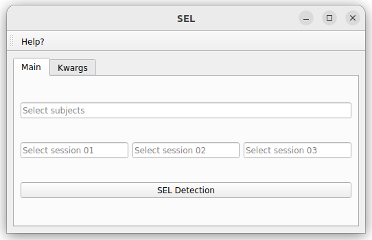
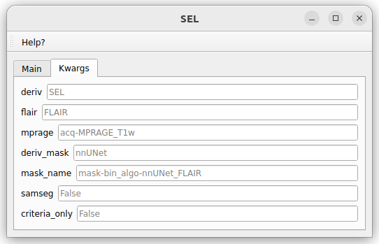
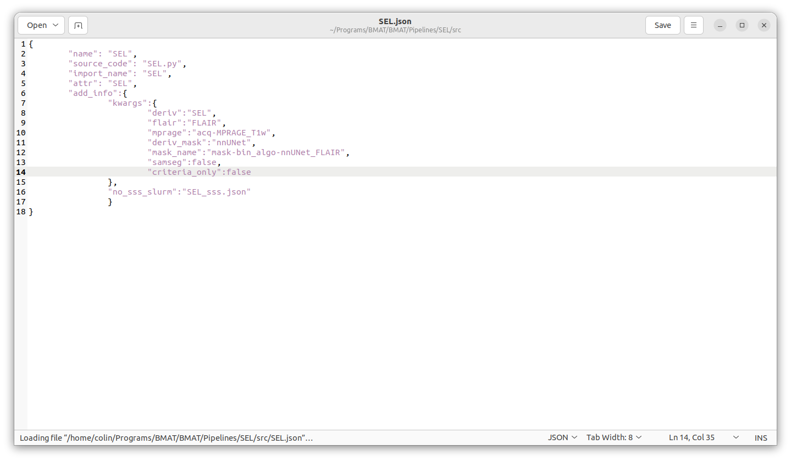

# SEL
Slowly Expanding Lesions (SELs) detection algorithm

>[!CAUTION]
>**Attention, this pipeline includes major methodological limitations ! It was implemented for methodological assessment purposes and should not be used without reading the associated paper (see How to cite below)!** ⚠️

## Requirements

Currently, all requirements pipeline should be installed on the user's computer and accessible via the terminal

**FreeSurfer**: FreeSurfer/7.3.2

**ANTs**

*A docker may be implemented in the future*

## How to cite

1. (coming soon)

2. Vanden Bulcke, C. et al. BMAT: An open-source BIDS managing and analysis tool. NeuroImage: Clinical 36, 103252 (2022).

## Utilization

The first figure below shows the window of this pipeline. This window contains the following information:

* "Select subjects" input: allows the user to script the automatic segmentation for subjects of the dataset by adding a list BIDS ID (without "sub-") separated by a comma. Possible values are: single BIDS ID (e.g. "001,002,006,013"), multiple folowing BIDS ID (e.g. "001-005" is the same as '001,002,003,004,005"), or all subjects ("all").

* "Select session 01" input: select the session id of the first timepoint for the SEL algorithm (e.g. "01")

* "Select session 02" input: select the session id of the second timepoint (should be later than than session 01) for the SEL algorithm (e.g. "02")

* "Select session 03" input: select the session id of the third timepoint (should be later than than session 02) for the SEL algorithm (e.g. "03")

* "SEL detection" button: launch the recon-all pipeline

*Typically, SEL detection takes a couple of hours.*

The second Tab "Kwargs" tab of the pipeline is used to enter specific arguments to use for the pipeline (see figure below). These arguments can be changed here for one specific run or their default values can be changed more permanently in the SEL.json file (see explanation in *Change pipeline option*). Here are a list of the different arguments for this pipeline:

* deriv: derivative output folder (default: SEL)

* flair: FLAIR image name in the anat folder (default: FLAIR)

* mprage: MPRAGE (or T1w) image name in the anat folder (default: acq-MPRAGE_T1w)

* deriv_mask: derivative folder of the binary segmentation mask (default: nnUNet)

* mask_name: binary lesion mask name (mask-bin_algo-nnUNet_FLAIR)

* samseg: Run SAMSEG instead of using a precomputed lesion mask (default: False)

* criteria_only: compute only the concentricity and constancy criteria (done on an already computed previous run) (default: False)

## Change pipeline option

In the SEL.json file, the user can choose some option in *add_info* to run this SEL pipeline (see figure below):

* "use_docker": there is currently no option to run this pipeline in a docker, the required dependent software (FreeSurfer, ANTs) should be installed on the user's computer

* "sss_slurm": precise the config file to run the pipeline on the SSS server (specific to UCLouvain members). If this tag does not exists (by default: "sss_slurm_no"), it will run the pipeline locally. To use this pipeline on remote server, change the name "sss_slurm_no" to "sss_slurm", and adapt the config file "FreeSurfer_sss.json" for your specific slurm need. This works with a correct "server_info.json" config file in the BMAT home directory.

* "kwargs": contains the default values of the arguments to be passed to the pipeline (values explained above in the *Kwargs* tab). 

